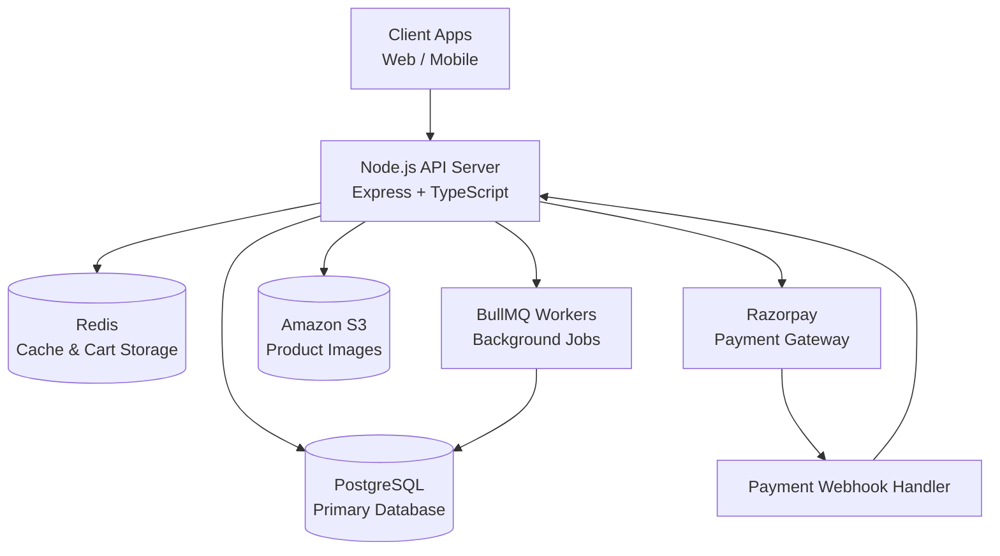

## System Architecture



## Order Processing Flow

```mermaid
sequenceDiagram
participant User
participant API
participant Inventory
participant Payment
participant Webhook
participant Queue

User->>API: Checkout Request
API->>Inventory: Reserve Stock
API->>Payment: Create Payment Order
Payment-->>User: Payment Page

Payment->>Webhook: Payment Success
Webhook->>API: Verify Signature
API->>Inventory: Deduct Stock
API->>Queue: Send Order Confirmation Email
```# ecommerce-backend
